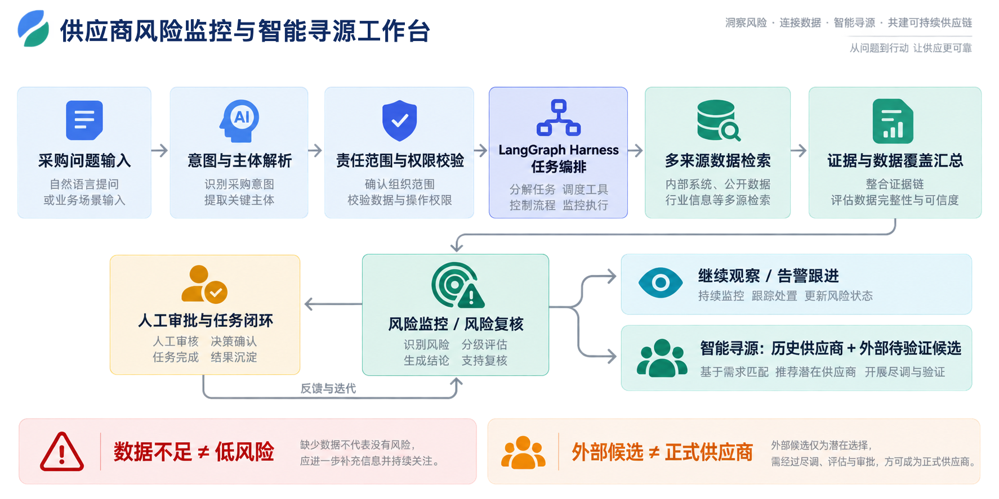
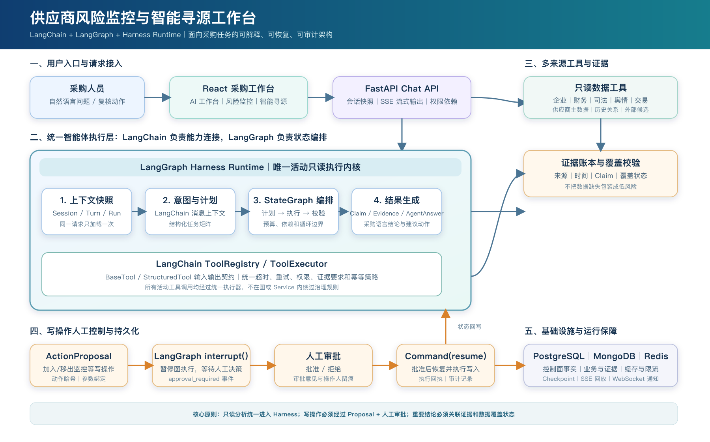
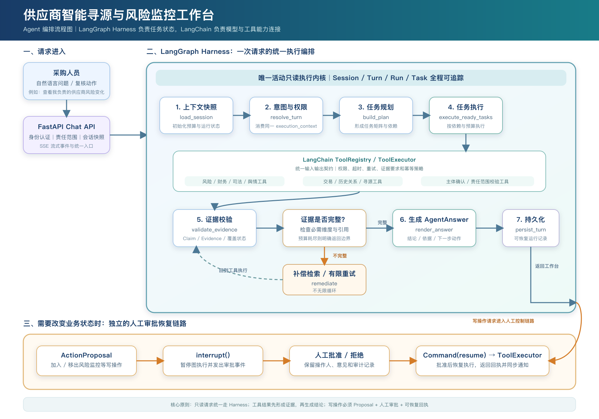

# 供应商智能寻源与风险监控工作台

> 全员 AI-“AI in ALL”劳动竞赛团队赛（工具/应用开发）参赛成果文档
>
> 文档版本：v1.3（项目事实基线：2026-09-16）
>
> 说明：方括号内容为提交时需要补充或替换的信息；提交版应删除未使用的占位内容。

**项目主线：** 每日飞书风险日报提醒采购人员关注变化，采购人员再通过工作台查看依据、发起复核，并继续寻找替代供应商线索。

> **项目简介：** 本项目面向采购人员建设供应商智能寻源与风险监控工作台。系统按责任范围生成风险信息和每日飞书提醒，支持采购人员在工作台中查看企业、财务、司法、舆情、交易和供应商关系信息，核对判断依据、安排复核，并筛选可进一步核验的替代供应商。

## 项目一页摘要

| 项目 | 内容 |
| --- | --- |
| 解决什么问题 | 供应商风险信息分散，采购人员难以及时发现变化、追溯依据并安排后续处理 |
| 核心用户 | 采购员、科室经理、供应商管理及风控协同人员 |
| 核心能力 | 每日飞书风险日报、风险监控、证据化分析、采购复核、智能寻源、告警和审批闭环 |
| 核心价值 | 将每日提醒、证据核对、风险复核和替代寻源纳入同一条采购工作流 |
| 当前阶段 | 核心能力已完成，处于可试点、待规模化业务验证阶段 |

## 项目主线

| ① 监控 | ② 复核 | ③ 处置 |
| --- | --- | --- |
| 持续发现责任范围内的供应商风险变化 | 用证据、时间和数据覆盖说明风险变化及其依据 | 通过人工审批、任务跟进和替代寻源推动后续处置 |

> **一句话概括：** 监控发现变化，复核确认依据，处置推动后续行动。

## 一、项目概述

### 1.1 参赛基础信息

**项目名称：** 供应商智能寻源与风险监控工作台

**项目定位：** 面向采购团队的 AI 供应商风险监控、风险复核和智能寻源辅助工作台。

**参赛选手信息：**

| 参赛选手 | 姓名 | 主要负责内容 | 工号 | 所属二级区域 | 所属三级区域 |
| --- | --- | --- | --- | --- | --- |
| 团队组长 | [待补充] | 统筹业务目标、产品设计、架构和验收 | [待补充] | [待补充] | [待补充] |
| 成员1 | [待补充] | 采购场景梳理、供应商数据和业务规则 | [待补充] | [待补充] | [待补充] |
| 成员2 | [待补充] | Agent、工具链和后端业务流程开发 | [待补充] | [待补充] | [待补充] |
| 成员3 | [待补充] | 前端工作台、交互体验和浏览器验收 | [待补充] | [待补充] | [待补充] |
| 成员4（如有） | [待补充] | 测试、数据准备、演示材料和推广 | [待补充] | [待补充] | [待补充] |

### 1.2 项目背景与目标

#### 项目背景

采购及伙伴生态中心在寻源定点、供应商准入及日常管理等业务中，需要持续关注供应商的经营、履约和合规风险。对于关键物料、核心项目和重要供应商，风险变化可能影响定点决策、交付保障和替代资源准备。因此，建立持续、可追溯的供应商风险监控机制，是提升供应保障能力和采购决策质量的基础。

目前，供应商风险管理仍主要依靠采购人员跨系统、跨平台查询和整理信息，尚未形成统一的数字化监控与智能分析支撑。风险信息分散，风险变化难以及时触达责任人，分析依据和跟进记录难以沉淀；当需要开展风险复核或替代寻源时，往往需要重复检索和人工汇总，影响处理效率和协同质量。

#### 项目目标

通过建设“供应商智能寻源与风险监控工作台”，统一供应商风险信息的查询、监控、复核和寻源入口，实现风险变化主动提醒、多来源信息归集、证据化复核、替代资源检索和处置过程留痕，为寻源定点、供应商管理和供应保障提供及时、完整、可追溯的决策支持。

系统以自然语言为入口，主要支持三类查询：

1. 查询本人负责供应商近期的风险变化；
2. 查询风险结论的依据及待补充、待核实事项；
3. 查询某个物料或品类的历史供应商和可验证外部候选。

项目围绕“日报提醒—监控—复核—处置”展开：飞书日报按责任范围推送重点变化，采购人员在工作台查看依据、完成复核，必要时继续开展替代寻源。风险分析、供应商画像、告警、审批和通知均服务于该主线。

**量化目标与当前可核验结果：**

| 指标 | 目标/口径 | 当前基线或结果 |
| --- | --- | --- |
| 演示数据稳定性 | 演示期间供应商范围和责任映射保持一致 | 已启用 `DEMO_DATA_FREEZE`；演示使用冻结的供应商与责任映射快照，具体数量以当次页面展示和验收记录为准 |
| 风险变化覆盖 | 能够返回责任范围内供应商的变化状态 | 固定演示问题返回责任范围内的风险状态；对数据点不足的对象明确标注“数据不足” |
| 主动提醒 | 每日向责任人发送重点风险变化 | 调度器默认每天 9:00 生成日报；按采购员和科室经理责任范围分别投递，真实送达情况以投递记录为准 |
| 寻源结果可解释性 | 候选按来源和核验状态分层 | 固定寻源场景展示历史合作、正式供应商和外部待核验候选，并保留匹配依据和来源说明 |
| Agent 核心质量 | 关键执行链路、审批和恢复可回归 | Harness 核心定向覆盖率 81.89%；真实 `agent_e2e_live` 场景已纳入验收 |
| 业务提效 | 以实际业务日志测量搜索、整理和复核耗时 | 当前尚未形成长期生产样本，正式材料不虚构节省工时；上线后按任务耗时和人工复核记录持续测量 |

## 二、现状分析

### 2.1 当前业务工作流程、现存工作模式

| 业务流程 | 当前工作方式 |
| --- | --- |
| 风险监控与复核 | 提出问题 → 多源检索 → 确认供应商信息与责任范围 → 翻阅资料 → 手工整理结论与待办 → 在其他系统或群聊中持续跟进 |
| 替代寻源 | 提出采购需求 → 回看历史合作 → 查询正式供应商 → 寻找外部候选 → 人工核验主体/资质/能力/风险 → 进入采购准入流程 |

该流程涉及多个信息来源和多次人工交接。采购人员既要完成资料查询和分析，也要持续跟进风险变化，并在必要时准备替代资源；查询结果和处理记录分散，增加了重复整理与沟通的工作量。

### 2.2 核心痛点梳理

| 核心问题 | 具体表现 | 对业务的影响 |
| --- | --- | --- |
| 信息分散 | 企业、财务、司法、舆情、交易和供应商关系分布在不同数据源 | 重复搜索、拼接上下文，整理成本高 |
| 风险变化发现不够及时 | 主要依靠定期查询或临时核查，查询间隔内的变化需要人工关注 | 可能延后核实和应对的时间 |
| 分析依据整理费时 | 需要逐项核对资料来源、更新时间及缺失信息，再形成判断 | 分析口径难以保持一致，复核时容易重复查找 |
| 后续跟进分散 | 风险结论、待办事项和处理进展分散在群聊、邮件或个人记录中 | 交接需要重新说明，未完成事项不易持续跟踪 |
| 替代资源准备耗时 | 出现需求后再查询历史合作记录、搜集外部候选并逐项核验 | 延长替代方案的准备时间 |

**使用过程中的问题：** 长耗时分析缺少过程反馈；SSE 中断或浏览器刷新后，任务不便恢复查看；风险变化、数据缺口和建议动作混在同一段文字中，采购人员难以快速判断后续处理方式。

### 2.3 现状量化数据支撑

目前尚未形成连续的生产环境工时日志和业务人员长期使用样本，因此以下内容采用“业务侧主观体验 + 当前流程拆解的保守测算”表达，不作为已经完成的生产实测成果。

> **改造前流程的估算描述（待业务试点验证）：** 采购人员需要在多个系统或数据源之间反复检索，确认资料对应的供应商，再整理风险依据、截图、链接和待办事项。按流程拆解估算，单家供应商的初步复核约需 30—60 分钟；遇到资料缺失或外部来源不可用的情况，还需要额外沟通和补充核验。风险发现后，复核事项和后续跟进依赖人工记录，存在信息遗漏、重复查询和跟进不及时的可能。

| 现状观察项 | 改造前保守测算/业务体验 | 数据说明 |
| --- | --- | --- |
| 单家供应商初步复核耗时 | 约 45 分钟 | 按跨系统检索、确认供应商资料、整理和形成待办估算，非生产日志实测 |
| 一次复核涉及的数据源 | 约 5 个 | 通常需要分别查看企业、财务、司法/经营、舆情和交易等信息 |
| 单次复核人工投入 | 约 0.75 人时 | 按 1 名采购人员完成一次初步复核估算 |
| 从发现风险到形成复核事项 | 约 120 分钟 | 受信息整理、供应商资料确认和内部沟通影响，复杂场景可能更长 |
| 人工补充资料次数 | 约 4 次 | 主要用于补充主体、财务、司法、舆情或供应商关系信息 |
| 出错风险表现 | 尚未形成统计概率 | 可能遗漏最新风险信息、引用过期资料或漏跟进待办事项，具体发生频率待试点记录 |
| 风险跟进方式 | 依赖人工记录和跨系统沟通 | 缺少统一的监控状态、复核任务、审批回执和闭环时长统计 |

这组基线用于说明问题规模和后续测量方法。正式试点后，将使用真实任务日志记录同一组指标，并以实际前后对比结果替换当前估算值。

### 2.4 当前已有解决方案局限性

**现有方案：** 当前主要依赖飞书供应商主数据和责任分配、采购月度交易快照，以及天眼查、财报、公开公告和舆情等外部来源；采购人员通过多个系统或接口分别查询，再使用 Excel、截图、链接、群聊或个人记录整理结果。现有方案能够提供基础数据，但尚未形成面向采购任务的统一智能工作流。

| 现有方案局限 | 具体表现 | 为什么需要 AI 智能体/工具 |
| --- | --- | --- |
| 数据入口分散 | 企业、财务、司法、舆情、交易和历史供应商关系分布在不同来源 | 通过自然语言入口统一理解问题，并自动编排多来源检索 |
| 依赖人工检索和拼接 | 采购人员需要自己决定查什么、查哪些系统、如何组合上下文 | 由智能体根据问题拆解任务，调用对应工具并汇总结果 |
| 缺少主动监控 | 传统查询主要依赖定期或临时发起，难以持续发现责任范围内的变化 | 建立监控对象、风险快照、变化趋势、告警和复核任务 |
| 结论难以追溯 | 手工整理的截图和链接容易分散，无法统一说明来源、时间和数据覆盖 | 用证据化结果关联来源、时间、事实路径和数据状态 |
| 数据缺失容易被误读 | 未查询、无结果、接口失败和真实无风险可能被混为一谈 | 由系统明确展示“未覆盖、未查询、查询失败、待核实”等状态 |
| 供应商与权限判断依赖人工 | 供应商资料和责任范围需要人工确认，容易重复沟通和查询 | 增加供应商候选、责任范围校验和按角色隔离的数据访问 |
| 风险分析与替代寻源割裂 | 风险发生后，还要重新查找历史供应商和外部候选 | 将风险复核与历史供应商召回、外部候选发现连接起来 |
| 缺少业务动作闭环 | 查询结果通常停留在文字或表格，无法直接形成任务、审批和审计记录 | 智能体生成建议动作，写操作经人工审批后执行并留痕 |
| 长任务不可观察、不可恢复 | 用户不知道任务进展，刷新或断线后可能需要重新提交 | 通过 SSE 进度反馈、运行状态持久化和断线回放提升可靠性 |

因此，系统将采购问题、数据检索、证据整理、风险复核和后续动作纳入同一流程，采购人员可由问题发起，逐步完成风险判断和寻源跟进。

## 三、方案设计

### 3.1 总体方案

本项目采用“统一自然语言入口 + 结构化任务编排 + 多来源证据账本 + 业务化结果展示”的方案。

**方案核心价值：** 系统汇总企业、财务、司法、舆情、交易和供应商关系等信息，先确认供应商信息和可查看范围，再通过任务编排和证据整理输出风险结论、待核实事项和建议动作。采购人员可基于风险变化继续完成复核和替代寻源，减少跨系统查询与手工整理，并为后续判断保留依据。

> **执行链路：** 采购人员提出自然语言问题 → 系统确认供应商信息和可查看范围 → 任务编排并检索多来源数据 → 汇总证据和数据覆盖情况 → 输出采购语言的风险结论与建议动作；只读结果直接展示，涉及业务状态变化的操作进入人工审批。

普通聊天和只读查询都进入 LangGraph Harness Runtime，执行路径保持一致。涉及加入/移出监控等业务状态变化时，系统先生成待审批动作，批准后才执行写入并返回结果。

### 3.2 业务流程改造设计

**旧流程：** 采购人员定期或临时提出需求 → 分别登录企业、财务、司法、舆情和交易等系统检索 → 手工确认供应商资料和责任范围 → 整理截图、链接和结论 → 通过群聊或其他系统通知、跟进；需要替代寻源时，再另行查询历史供应商和外部候选。

**新流程：** 系统每天按责任范围生成飞书风险日报 → 采购人员从日报进入工作台或直接输入自然语言问题 → 系统确认供应商信息和可查看范围 → Agent 编排多来源工具检索 → 返回带证据、时间和数据覆盖说明的风险结论 → 需要改变监控状态时发起人工审批 → 如需替代方案，继续生成历史供应商和外部待验证候选。

| 流程环节 | 旧流程 | 新流程改造 | 带来的变化 |
| --- | --- | --- | --- |
| 问题输入 | 私聊、口头沟通或分别打开多个系统 | 在统一工作台用自然语言提出问题 | 降低入口和沟通成本 |
| 日常提醒 | 依赖人工定期查看或手工转发 | 每日按责任范围生成飞书风险日报，异常提醒独立触发 | 将重点变化及时推送至责任人 |
| 信息检索 | 人工跨系统搜索、复制和拼接资料 | Agent 按任务编排多来源工具 | 减少重复检索和人工整理 |
| 供应商与权限 | 依赖人工确认供应商资料和可见范围 | 系统先做供应商候选与责任范围校验 | 降低资料对应错误和越权查询风险 |
| 结论形成 | 手工整理风险等级、截图和待办 | 输出事实、证据、数据边界和建议动作 | 结论更易复核、沟通和追踪 |
| 后续处置 | 在群聊或其他系统中手工跟进 | 复核任务、告警、审批和审计形成闭环 | 从一次性查询变为持续监控 |
| 替代寻源 | 重新查询历史供应商和外部企业 | 分层返回历史合作、正式供应商和外部待验证候选 | 线索与正式准入边界更清晰 |

> **图 1｜业务流程改造与总体方案流程图**　以“监控—复核—处置”为核心主线，向前连接自然语言入口、主体与权限校验、多来源数据检索，向后连接人工审批闭环和智能寻源。底部两条提示用于强调系统的数据解释边界。

### 3.3 智能体/应用功能架构设计

| 模块 | 主要能力 | 业务输出 |
| --- | --- | --- |
| 采购工作台 | 风险状态概览、近 30 天告警趋势、风险分布和排名、常用任务入口 | 提供整体概览，并进入需要关注的供应商或任务 |
| 采购助手 | 自然语言风险监控查询、风险复核、趋势、舆情、财务、合规和寻源 | 结论、证据、数据边界、建议动作 |
| 风险监控 | 监控对象、风险快照、变化趋势、告警、主体确认和复核任务 | 风险变化、判断依据和建议动作 |
| 寻源建议 | 历史供应商召回、正式供应商匹配、外部候选发现、主体与风险核验 | 候选分组、来源、匹配依据、待核验项 |
| 供应商库与画像 | 正式供应商只读快照、风险/财务/关联/日志视图 | 供应商信息和画像详情 |
| 风险通知与每日简报 | 每日定时飞书风险日报、异常提醒、站内通知、实时推送、投递重试记录 | 采购员收到本人负责范围的提醒，科室经理收到所属科室的汇总 |
| 审批与审计 | 写操作 Proposal、人工审批、执行回执和操作记录 | 业务动作有确认、有回执、有记录 |
| 账号与基础数据管理 | 账号信息与密码管理、供应商及责任分配只读同步 | 保持身份、供应商和责任范围一致 |

**模块之间的数据流转关系：** 用户在采购助手中输入问题后，问题先进入意图识别和任务编排；系统根据用户身份、供应商主体和责任范围完成权限校验，再调用风险、财务、司法、舆情、交易和历史关系等数据工具。工具结果整理为证据和数据覆盖状态，由 Agent 汇总成风险结论、待核实事项和建议动作，返回工作台展示。涉及加入/移出监控等状态变化时，结果先进入审批模块，审批通过后执行写入，并将回执同步到通知、任务和操作记录。

> **流程概括：** 用户提出问题，系统安排任务并调用工具；工具结果形成证据，证据支撑风险判断，判断结果再进入复核、审批、通知或寻源流程。

### 3.4 数据、证据与解释边界

| 数据来源 | 主要用途 | 系统明确的解释边界 |
| --- | --- | --- |
| 天眼查 API | 工商主体、司法、经营异常等风险核验 | 不能替代现场审计、质量结论或供应商准入 |
| 上市公司财报 | 盈利、现金流、偿债和财务趋势 | 非上市主体无财报时，展示“未覆盖”，不生成虚假财务结论 |
| 采购月度快照 | 交易连续性、结算金额或收货记录变化 | 收货记录数不等于零件数量、采购金额或交付能力 |
| 飞书供应商主数据 | 正式供应商、责任归属、科室和采购员 | 当前以只读同步为主，不自动写回源主数据 |
| 历史关系与外部候选库 | 历史合作关系和寻源线索 | 外部候选标记“待验证”，不等于正式供应商或已准入 |
| 公开公告与舆情来源 | 风险事件和舆情信号 | 访问受限、未查询或无结果均显示覆盖状态，不等于无风险 |

每个重要 Claim 尽量关联来源、数据时间、事实路径或工具证据。对于“正常结果”“资料待补充”“主体待确认”“权限不足”“部分完成”和“执行失败”，系统分别显示对应状态，不会把数据空缺直接当成低风险。

### 3.5 权限、安全与人工控制

- 采购员仅能访问本人负责的正式供应商、监控对象、风险快照和告警；
- 科室经理可访问所属科室采购员负责的范围；管理员可访问全量演示数据和运维能力；
- 工具层和 API 层均执行责任范围校验，缺少身份或无法确认责任关系时采用拒绝访问策略；
- 主体未确认时，不创建稳定监控绑定，不生成正式风险核验结果；
- 加入/移出监控等写操作只创建待审批项，未批准前不修改业务状态；
- PostgreSQL 保存用户、责任快照、Session/Turn/Run/Task/Proposal 等控制面事实；MongoDB 保存业务数据、证据、风险快照和展示记录；Redis 仅用于缓存和限流。

## 四、项目落地

### 4.1 数据准备工作：数据来源、数据清洗、知识库入库方案

本项目以供应商风险监控和智能寻源的业务数据为主，不以制度文档问答为主要场景。数据准备重点是确认供应商身份和责任范围，并记录来源时间、数据覆盖状态和证据，便于后续查看和复核。

#### 数据来源

| 数据类别 | 主要来源 | 用途 |
| --- | --- | --- |
| 正式供应商主数据 | 飞书供应商主数据及责任分配 | 识别正式供应商、供应商代码、采购员、科室和责任范围 |
| 采购业务数据 | 采购月度交易快照、收货和结算记录 | 分析交易连续性、金额变化和异常波动 |
| 历史合作关系 | 历史供应商与物料/品类关系 | 召回曾经合作过的供应商，形成优先寻源线索 |
| 企业与风险信息 | 天眼查 API、工商和司法等公开企业信息 | 完成主体候选、工商信息和经营风险核验 |
| 财务信息 | 上市公司财报及已配置财务数据 | 辅助分析盈利、现金流、偿债和财务趋势 |
| 舆情与外部候选 | 公开公告、行业信息、外部候选发现来源 | 发现风险事件和外部待验证寻源候选 |

#### 数据清洗与标准化

1. **统一企业身份。** 优先使用统一社会信用代码、供应商代码或天眼查企业标识；企业名称仅作为检索线索，不作为唯一绑定依据。
2. **统一字段和状态。** 规范供应商名称、编码、责任人、品类、数据时间和来源字段，并区分“正常结果、未覆盖、未查询、查询失败、主体待确认”等状态。
3. **去重与关联。** 按供应商代码、统一社会信用代码和已确认主体去重；将正式供应商、历史合作供应商和外部候选建立清晰的来源关系。
4. **保留证据链。** 重要数据保留来源、抓取/更新时间、原始链接或事实路径，避免只保存无法复核的最终分数。
5. **标记数据缺口。** 非上市企业无公开财报、外部接口不可用或公告详情页不可访问时，保留“未覆盖/部分覆盖”说明，不补造结论。

#### 入库与验收方案

| 入库对象 | 存储与处理方式 | 验收要求 |
| --- | --- | --- |
| 供应商主数据、责任范围和用户权限 | 同步为正式供应商只读快照，并由 PostgreSQL 保存控制面状态 | 能按采购员、科室经理和管理员区分可见范围 |
| 风险、财务、司法、舆情和交易数据 | 保存到 MongoDB 业务数据集合，统一转换为证据和数据覆盖记录 | 每条重要结论可查看来源、时间和覆盖状态 |
| 历史供应商与外部候选 | 按来源、匹配依据和核验状态分层保存 | 外部候选明确标记“待验证”，不自动成为正式供应商 |
| 长任务、审批和审计记录 | PostgreSQL 保存 Session/Turn/Run/Task/Proposal 等状态，Redis 负责缓存和限流 | 支持任务恢复、审批回执和操作追踪 |

入库完成后，使用固定供应商范围、固定问题和固定候选场景进行抽样验收。当前演示启用 `DEMO_DATA_FREEZE`，冻结供应商、责任映射和候选快照，保证同一版本演示结果可复现；涉及实时统计的数量以当次页面展示和验收记录为准。

### 4.2 核心功能实现说明（含关键功能截图）

| 核心功能 | 实现方式 | 用户可见结果 |
| --- | --- | --- |
| 采购助手 | 用户直接输入风险监控、企业复核、趋势分析或寻源问题；进入 LangGraph Harness Runtime 处理 | 减少对复杂筛选条件的依赖，直接获得采购语言的任务结果 |
| 多来源风险分析 | 由任务编排调用企业、财务、司法、舆情、交易和供应商关系等工具，统一汇总结果 | 输出风险变化、证据来源、数据覆盖和待核实事项 |
| 风险监控与复核 | 先确认供应商信息和责任范围，再生成风险快照、变化趋势、告警和复核任务 | 支持采购人员持续观察责任范围内供应商，并进入复核流程 |
| 每日飞书风险日报 | 调度器按日汇总监控快照和最新告警，按采购员、科室经理的责任范围分别投递 | 采购员收到本人范围内的重点变化，经理收到所属科室汇总；异常提醒另按规则触发 |
| 智能寻源 | 优先召回历史合作供应商和正式供应商，再展示外部待验证候选，并提供匹配依据 | 候选按来源和核验状态分层，避免将线索误认为准入结果 |
| 证据与解释边界 | 每个重要判断关联来源、时间、事实路径和数据状态，明确区分数据不足与低风险 | 结论可追溯、可解释，便于采购沟通和人工判断 |
| 权限、审批与审计 | 按责任范围隔离数据；加入/移出监控等写操作先创建待审批项，批准后才执行 | 关键业务动作保留人工确认、执行回执和审计记录 |
| 实时反馈与恢复 | 通过 SSE 返回任务进度、工具结果和最终结论，服务端持久化运行事件 | 长任务过程可观察，断线或刷新后可继续查看结果 |

**核心功能数据流：** 用户输入问题 → 意图识别与任务编排 → 主体及责任范围校验 → 多来源数据检索 → 证据合并与覆盖判断 → 输出风险/寻源结果 → 按需进入复核任务、人工审批、通知和审计。

#### 采购助手支持的查询范围

采购助手支持整体监控、单家供应商专项分析、历史变化查询、供应商对比和替代资源检索。以下示例用于说明提问方式，实际回答受用户权限、已接入数据和资料完整程度影响。

| 问题类型 | 示例提问 | 回答内容 |
| --- | --- | --- |
| 责任范围内的风险监控 | “查询本人负责供应商近期的风险变化” | 监控清单、风险状态、变化趋势和重点关注对象 |
| 单家供应商综合复核 | “复核某供应商当前需要关注的事项” | 风险结论、主要依据、数据缺口和后续核实建议 |
| 财务分析 | “查询该供应商的财务状况” | 可获取的财务指标及其含义，说明数据期间和缺失情况 |
| 司法与经营异常 | “查询该供应商的诉讼、被执行和行政处罚记录” | 已检索到的司法、经营异常信息及来源，提示待核实事项 |
| 舆情与新闻 | “查询该供应商近期负面新闻” | 可获取的新闻和舆情信号、相关依据及关注建议 |
| 商务风险 | “分析该供应商的采购依赖程度” | 基于已校验月度交易快照分析供应依赖与可替代性，并说明交易观察信号 |
| 历史趋势与供应商对比 | “查询该供应商的风险趋势”“比较两家供应商” | 历史变化或多家供应商的指标差异，注明可比较的数据范围 |
| 供应链关系 | “分析该供应商的关联关系和风险传染情况” | 已有关系数据中的关联主体、风险信号及进一步核查建议 |
| 合规与 ESG | “查询该供应商是否存在制裁风险”“分析该供应商的 ESG 情况” | 已接入来源中的筛查结果，以及环境、社会和治理相关信息 |
| 风险预测 | “查询该供应商未来的风险恶化迹象” | 基于现有数据的预警评分、预测结果和触发信号，供人工研判参考 |
| 智能寻源 | “查询后轮制动鼓的供应商”“为该供应商寻找备选资源” | 历史合作、正式供应商及外部待验证候选，附来源与匹配依据 |
| 企业资料 | “查询该供应商的工商信息和企业画像” | 企业基本信息、工商资料及可获取的画像信息 |
| 质量与交付查询 | “查询该供应商近期质量或交付风险” | 查询已校验内部快照；缺少相应指标时说明数据不足和需要补充的资料 |
| 风险报告 | “生成该供应商的风险评估报告” | 汇总已有分析结果生成报告；当前聊天编排采用 HTML 报告，报告工具另支持 Excel 格式 |

**回答呈现方式：** 按问题类型组织结论、依据和下一步建议，提供来源、时间和数据覆盖信息。支持继续查询相关细节；涉及加入或移出监控的操作，须经人工确认后执行。

**当前使用边界：** 质量、物流及零件级明细尚需进一步接入业务系统，已具备查询处理入口不代表数据已经齐全。预测结果不代表确定会发生的事件，外部候选仍需履行采购准入核验。宏观风险、情景模拟已有后端接口和工具；自定义定时报告已有任务管理代码，但本次未确认其自动调度接入，暂不列为日常聊天已完整交付的能力。

#### 每日飞书风险日报与异常提醒

系统提供定时推送机制，每天汇总已纳入监控的供应商情况，通过飞书向对应责任人发送风险日报，为采购人员当天的核查与跟进提供依据。

| 项目 | 当前实现 |
| --- | --- |
| 发送时间 | 代码默认每天 9:00 触发，可通过部署配置调整；按调度器运行环境时区执行 |
| 接收对象 | 按供应商责任关系分别发给采购员和科室经理；采购员查看本人范围，经理查看所属科室汇总 |
| 日报内容 | 负责范围内的监控供应商数量、重点关注企业及其评分和等级、最近告警变化 |
| 汇总范围 | 使用已保存的最新风险快照和告警；重点关注最多列 8 家，最近变化最多列 5 条，不等同于当天完成全量刷新 |
| 异常提醒 | 除日报外，独立的告警通知任务默认每 30 分钟检查一次，按规则生成并投递风险提醒 |
| 投递记录 | 留存通知与发送结果，单次投递最多尝试 3 次，便于排查失败原因；同时提供站内通知与实时消息反馈 |

**运行流程：** 定时任务触发 → 读取监控清单和责任关系 → 汇总各自范围内的风险快照与告警 → 生成采购员或科室日报 → 通过飞书逐人投递 → 保存通知和投递记录。

**配套后台任务：** 调度器还注册了日常财务检查、每周全量刷新、每日舆情分析和周期性主动分析；启用飞书数据同步且未冻结演示数据时，按配置同步供应商主数据与责任关系。各项任务分别运行，日报反映的是汇总时已入库的数据。

**使用条件：** 需要服务持续运行、飞书应用凭据和消息权限配置有效、接收人身份及责任关系完整。本节依据代码说明实现机制，真实按时送达情况需结合部署环境和投递记录验收。

#### 关键功能截图（建议插入飞书文档）

| 截图 | 建议展示内容 | 图下注释 |
| --- | --- | --- |
| [风险监控结果页](screenshots/01-risk-monitoring.png) | 风险变化、综合结论、证据覆盖和数据不足提示 | 监控先发现变化，再用证据判断是否需要跟进 |
| [风险复核结果页](screenshots/02-risk-review.png) | 风险信号、证据来源、待核实事项和复核任务/审批卡 | 复核结论可追溯，关键写操作保留人工确认 |
| [寻源任务与候选复核入口](screenshots/03-sourcing-results.png) | 自然语言采购需求、采购进度、候选来源和人工确认节点 | 系统先形成寻源线索，再由采购员确认后续核验动作 |

> **截图说明：** 本项目当前重点展示业务功能结果和关键控制节点，不依赖制度文档式 RAG 后台配置。若比赛要求展示后台配置，可在本节表格后补充运行配置、数据冻结开关或数据源状态截图。

### 4.3 技术架构与实现

系统由前端工作台、FastAPI 接入层、LangChain 能力连接层、LangGraph 状态编排层、工具执行层以及数据和证据存储层组成。LangChain 负责模型消息、工具协议和结构化输入输出；LangGraph 负责任务状态、节点流转、暂停恢复和执行边界。

> **图 5｜LangChain 与 LangGraph 技术架构图**　LangChain 连接模型和工具，LangGraph Harness 编排一次请求内的任务状态；只读分析经过证据校验后返回结果，涉及业务状态变化的操作进入人工审批和恢复链路。

#### 4.3.1 架构分层与技术职责

| 架构分层 | 主要技术组件 | 处理内容 |
| --- | --- | --- |
| 用户与交互层 | React、Vite、采购工作台、风险监控、智能寻源、供应商库 | 接收自然语言问题，展示任务进度、风险变化、证据、候选和下一步动作 |
| API 与会话接入层 | FastAPI、JWT/责任范围依赖、SSE、WebSocket | 完成身份认证、请求接入、会话管理、流式输出和实时通知 |
| 模型与消息层 | DeepSeek（OpenAI 兼容接口）、`langchain-openai`、`langchain-core` | 组织 System/Human/AI 消息，辅助意图理解、任务规划和采购语言表达 |
| 状态编排层 | LangGraph `StateGraph`、Harness State、PostgreSQL Checkpoint | 管理节点状态、任务依赖、执行预算、循环边界和中断恢复 |
| 工具执行层 | LangChain `BaseTool`/`StructuredTool`、ToolRegistry、ToolExecutor | 注册工具并校验输入输出，处理超时、重试、权限、证据和幂等策略 |
| 证据与答案层 | EvidenceLedger、Claim、Evidence、AgentAnswer | 合并工具结果，校验证据覆盖，生成带来源、边界和建议动作的结构化回答 |
| 数据与运行保障层 | PostgreSQL、MongoDB、Redis、SSE 回放、WebSocket | 保存控制面事实、业务数据与证据，提供缓存、限流、任务恢复和风险通知 |

#### 4.3.2 LangChain 能力连接层

1. **模型连接。** 通过 OpenAI 兼容接口连接 DeepSeek，将采购问题、用户上下文和必要的历史引用组织为标准消息输入，输出意图、计划或采购语言摘要。
2. **工具抽象。** 业务能力以 LangChain `BaseTool`/`StructuredTool` 形式注册，工具输入由 Pydantic 模型约束，输出统一转换为结构化工具结果。
3. **工具注册。** `ToolRegistry` 保存工具名称、版本、能力类型、读写属性、审批策略、超时、重试、幂等和是否要求证据等执行策略。
4. **统一执行。** LangChain 工具不会直接绕过业务规则；所有活动工具调用都由 `ToolExecutor` 执行，在执行前完成用户身份、责任范围、参数和策略校验。
5. **结果标准化。** 工具结果被转换为 `Claim`、`EvidenceRecord` 和数据覆盖状态，供 LangGraph 后续节点统一合并和校验。

#### 4.3.3 LangGraph Harness 执行流程

聊天和只读查询都进入 LangGraph Harness Runtime，主要执行路径如下：

> **图 6｜Agent 编排流程图**　用户问题经 FastAPI 进入 LangGraph Harness，完成上下文快照、意图与权限解析、任务规划、工具执行、证据校验和 AgentAnswer 生成；证据不足时进入有限补偿检索，涉及业务状态变化时转入人工审批与可恢复执行链路。

| LangGraph 节点 | 节点职责 | 关键产物 |
| --- | --- | --- |
| `load_session` | 检查 Session、Turn、Run 和用户问题等必要身份字段，初始化执行预算 | 初始 Harness State、运行预算和持久化事件 |
| `resolve_turn` | 消费请求前已经解析好的 `execution_context`，确定当前任务和责任范围 | 当前任务快照，不在图内重复加载会话状态 |
| `build_plan` | 根据意图、供应商主体、分析维度和任务依赖生成任务矩阵 | `HarnessTask` 列表、补偿/重试计划 |
| `execute_ready_tasks` | 按依赖和预算选择可执行任务，可并行调用多个只读工具 | 工具结果、调用轨迹、Claim 和 Evidence |
| `validate_evidence` | 汇总证据、检查必需维度和 Claim 引用，判断是否需要补偿检索 | 证据覆盖状态、循环退出原因 |
| `remediate` | 在允许的范围内补充缺失证据或有限重试 | 补充工具结果，不无限循环 |
| `render_answer` | 根据已校验证据生成结构化 AgentAnswer 和采购语言结论 | 结论、限制说明、证据引用和建议动作 |
| `persist_turn` | 保存本轮运行状态和最终结果 | 可恢复的 Turn/Run 记录 |

**主流程：** `START → load_session → resolve_turn → build_plan → execute_ready_tasks → validate_evidence → render_answer → persist_turn → END`。当证据不足且满足补偿条件时，执行 `validate_evidence → remediate → execute_ready_tasks` 的有限循环；预算耗尽、超时或依赖阻塞时，系统返回明确的部分完成或不可用状态。

#### 4.3.4 写操作、审批恢复与实时事件

加入/移出监控、创建寻源请求、选择候选等可能改变业务状态的操作，不与普通只读分析混用，采用独立的人工控制链路：

`ActionProposal → LangGraph interrupt() → approval_required → 人工批准/拒绝 → Command(resume=...) → ToolExecutor 执行 → 执行回执与审计记录`

未批准前不执行写入；恢复时原样传递 LangGraph `Command`，避免把审批恢复误当成普通用户消息。前端通过 SSE 接收 `thinking`、`tool_call`、`tool_result`、`evidence`、`workflow_status`、`approval_required`、`agent_answer`、`done` 和 `error` 等事件，服务端按 Run ID 持久化事件，断线后可使用 `Last-Event-ID` 回放未消费结果。

#### 4.3.5 数据、状态与安全边界

| 数据/状态 | 唯一职责 | 存储位置 |
| --- | --- | --- |
| Session、Turn、Run、Task、Proposal、用户和责任快照 | 控制面事实、审批状态和运行生命周期 | PostgreSQL，作为控制面唯一事实源 |
| 供应商、风险、财务、舆情、交易和证据记录 | 业务数据、证据和前端展示所需快照 | MongoDB |
| 缓存、限流和短期运行加速数据 | 提升响应效率，不能替代业务事实 | Redis |
| LangGraph Checkpoint | 保存可恢复的图执行状态 | PostgreSQL Checkpoint |
| SSE/实时通知事件 | 反馈任务过程、证据和执行回执 | Run 事件存储 + SSE/WebSocket |

安全边界由 API 层、ToolExecutor 和数据访问层共同执行：采购员只能访问本人责任范围内的正式供应商；主体未确认时不创建稳定监控绑定；外部候选只作为待验证线索；写操作必须经过人工审批；数据缺失、查询失败和权限不足必须在结果中明确表达。

### 4.4 项目落地难点、攻关过程与优化成效

本项目并非将通用大模型直接接入聊天窗口，而是在多源数据、采购权限、人工审批和长链路运行约束下重构业务流程。难点集中在“结果是否可信、对象是否正确、动作是否受控、过程是否可恢复”四个方面。

| 落地难点 | 为什么难 | 攻关做法 | 已形成的能力 |
| --- | --- | --- | --- |
| 多来源数据异构且覆盖不完整 | 财务、司法、舆情、交易和供应商主数据的时间、粒度、可信度不同；任一来源缺失都不能被误读为无风险 | 将工具结果统一转换为 Claim、Evidence 和数据覆盖状态；回答按“事实—风险信号—推断—建议动作”分层，并记录来源和数据时间 | 每个结论均可回看依据；未覆盖、失败和无异常记录分开表达 |
| 自然语言多轮提问容易丢失或继承错误上下文 | 采购员会从“看风险”继续追问“依据是什么”“下一步怎么办”，也会在同一会话切换物料品类；错误复用上一轮对象会直接影响采购判断 | 每轮请求只加载一次执行上下文；显式新寻源任务重置旧需求与候选；对供应商名称、能力类型、任务目标和证据引用做契约校验 | 支持连续追问和跨任务切换，避免旧供应商、旧品类或旧证据混入当前结论 |
| 供应商名称、外部候选与正式供应商不能混为一谈 | 名称是检索线索，不足以支撑监控、风险评分或采购准入；外部候选常缺少本地主体和责任范围映射 | 以供应商代码、统一社会信用代码和已确认身份建立稳定绑定；主体不确定时停在待确认状态；外部候选单独标记为待核验线索 | 既能展示候选资料，又不会将外部线索误写入正式供应商或监控清单 |
| 责任范围与写操作需要服务端刚性约束 | 页面隐藏按钮不能防止接口越权；AI 若直接执行加入/移出监控，可能造成业务状态被误改 | API、ToolExecutor 和数据访问层同时校验用户身份、责任范围和读写策略；写操作先生成 Proposal，再经人工审批恢复执行 | 实现“系统提出建议—人员批准或拒绝—执行回执和审计留痕”的受控闭环 |
| 多工具编排具有超时、部分失败和无限循环风险 | 一次复核可能包含多个并行工具，外部数据源波动会造成缺证、超时或重复补偿 | LangGraph Harness 管理任务依赖、执行预算和有限补偿循环；工具统一配置超时、重试、幂等和证据要求 | 返回完整、部分完成或不可用等明确状态，不用空结果伪造确定性结论 |
| SSE 流式回答和审批过程可能被刷新或断网中断 | 长任务中用户刷新页面、网络短断或审批后恢复，容易重复提交或丢失已完成结果 | 按 Session、Turn、Run、Task 保存控制面状态，持久化 SSE 事件；前端通过 `Last-Event-ID` 回放未消费事件 | 可恢复查看任务进度、工具结果和审批状态，降低重复执行风险 |
| 比赛演示与真实运行需要兼顾稳定性和边界真实性 | 演示数据变化会影响画面和结果；过度“冻结”又会掩盖真实数据覆盖边界 | 使用演示数据冻结开关、固定问题和验收清单；页面仍保留来源、时间、未覆盖和待核验提示 | 同一版本下可复现实验场景，同时不把演示快照包装成生产全量数据 |

#### 4.4.1 优化过程：从“能回答”到“能用于采购复核”

项目的优化不是一次性完成，而是沿着真实验收中暴露的风险逐步收口。所有问题均记录在《问题与修复记录》，并要求“先记录、后修复、再回归”。

| 优化阶段 | 发现的问题 | 关键优化 | 验证方式 |
| --- | --- | --- | --- |
| 第一阶段：回答可解释 | 单一风险摘要难以让采购人员判断依据；缺失数据容易被误解 | 建立 EvidenceLedger、Claim 与答案契约，将依据、数据时间和覆盖状态纳入结果 | 证据不足、来源冲突、未覆盖数据的定向回归与页面验收 |
| 第二阶段：多轮任务正确 | 同一会话切换品类时可能沿用上一轮候选；口语化输入可能影响对象解析 | 新任务重置上下文；收敛确定性解析与模型实体结果；保留原始任务完成澄清恢复 | 多轮寻源、口语前缀、澄清—确认—分析链路回归 |
| 第三阶段：对象与权限受控 | 主体待确认、外部候选和正式供应商边界不清；跨责任范围存在泄露风险 | 引入主体确认门禁、责任范围校验和外部候选分层；未满足条件时停止后续写入 | 主体待确认、越权、外部候选和正式供应商分层验收 |
| 第四阶段：写操作安全 | 分析建议与加入监控等业务动作混用，存在绕过审批的风险 | 将写操作拆为 Proposal、审批中断、恢复执行和回执四步，所有恢复均经过统一执行器 | 审批批准、拒绝、重复提交和恢复场景的 Agent E2E |
| 第五阶段：运行稳定 | SSE 中断、刷新和长任务失败会导致用户误以为结果丢失 | 持久化 Run 状态和事件，增加断线回放、执行预算、超时与部分完成状态 | 真实服务、数据库、SSE 回放和浏览器刷新验收 |

**落地成效：** 系统已从“自然语言查询原型”演进为“自然语言入口—对象与权限校验—多源检索—证据输出—风险复核—审批控制—任务留痕”的受控工作流。课题难度不在于调用模型本身，而在于让模型输出能够进入采购业务链路，并在数据不完整、对象不确定、权限受限和任务中断时保持可解释、可控制和可恢复。

### 4.5 工程质量基线

项目已建立后端 pytest、FastAPI TestClient、Agent E2E、前端 Vitest、TypeScript、ESLint、生产构建和真实链路验收。测试方法、结果和业务场景验证集中放在第五章。

> **质量基线摘要：** 截至 2026 年 9 月 15 日，后端完整回归 996 项，前端 Vitest 113 项；Harness 核心执行路径定向覆盖率 81.89%；TypeScript、ESLint、生产构建、PostgreSQL、MongoDB、Redis、checkpoint 及 SSE 断线回放链路已完成验收。后端全量运行中的单个 PostgreSQL 行锁用例已在隔离条件下单独重跑通过。

### 4.6 当前限制与提交信息

提交前需要补齐以下信息或完成最后检查：

1. 补充参赛队员、工号、组织信息和正式演示地址；
2. 核对演示环境、评审账号、飞书应用凭据和消息权限；
3. 当前比赛演示使用冻结的供应商与责任映射快照，外部数据覆盖受接口和套餐影响，页面会明确显示数据边界；
4. 完成最后一轮页面语言检查，确认正式演示界面不展示内部字段；
5. 本项目输出的是复核线索和寻源辅助结果，不替代现场审计、质量审核、报价、准入或采购决策。

### 4.7 项目特点与后续提升方向

#### 项目优势

| 项目特点 | 业务价值 |
| --- | --- |
| 业务场景完整 | 覆盖日报提醒、风险监控、证据复核、任务跟进和替代寻源 |
| 结论可核对 | 同时展示来源、时间、数据覆盖状态和待核验项 |
| 操作可控制 | 按责任范围隔离数据，状态变化经过人工审批并留存回执 |
| 结果有边界 | 外部候选与正式供应商分层，数据缺失不直接解释为低风险 |
| 具备复用条件 | 主体确认、证据记录、告警和任务机制可扩展到供应链、质量和合规协同 |

#### 后续提升方向

| 提升方向 | 当前阶段 | 后续计划 |
| --- | --- | --- |
| 业务价值量化 | 已有工程、测试和演示基线，尚缺真实用户前后耗时对比 | 补充 5—10 个真实案例，记录复核耗时、数据源数量、人工补充次数和告警闭环时长 |
| 主线表达聚焦 | 功能覆盖多个环节，核心使用路径需要保持清楚 | 统一使用“日报提醒→风险监控→风险复核→后续处置/替代寻源”作为演示和材料主线 |
| 数据覆盖扩展 | 当前冻结演示数据受数据源与接口覆盖限制 | 扩充正式供应商、财务资料、舆情来源和历史物料关系，并保留覆盖状态提示 |
| 业务用户反馈 | 当前验收记录以工程测试和项目自测为主 | 补充采购人员或项目负责人的真实使用反馈，形成需求—改进—验证闭环 |
| 结果表达完善 | 个别风险摘要仍可能出现内部字段或英文状态 | 完成采购语言本地化，并重新进行真实 SSE 和浏览器验收 |

> **阶段判断：** 项目已完成核心产品能力和工程验证，当前处于“可试点、待规模化证明”阶段。下一阶段的重点是用真实业务样本证明采购人员能够更早发现风险、减少重复查询，并更快完成复核跟进。

## 五、测试验证与效果评估（重点评审板块）

> **本章证据口径：** 工程测试用于证明系统能够运行，固定场景验收用于证明核心业务链路能够完成，业务试点数据才用于证明真实提效。当前已经完成前两类验证，业务工时和差错率尚未形成生产样本，因此文中的测算值只用于说明测量方法，不作为已实现成果。

### 5.1 测试方案：功能测试、全流程联调、业务人员试用测试

项目按“功能正确—流程可用—业务有效”三个层次进行验证。

1. **功能测试：** 使用后端 pytest、FastAPI TestClient、Agent E2E、前端 Vitest、TypeScript、ESLint 和生产构建，检查接口、工具、Agent 状态、审批组件和页面交互。
   - 截至 2026 年 9 月 15 日，后端完整回归 996 项；其中一次全量运行有 995 项通过，唯一的 PostgreSQL 行锁用例在停止开发服务后单独重跑通过；
   - Harness 核心执行路径定向覆盖率 81.89%；
   - 前端 Vitest 113 项、TypeScript、ESLint 和生产构建通过。
2. **全流程联调：** 覆盖风险监控、单家供应商复核、财务/司法/舆情专项分析、替代寻源、数据不足、主体待确认、跨责任范围访问、写操作审批、审批恢复、SSE 中断和页面刷新等场景。
3. **业务试点测量：** 当前尚未形成连续的生产使用样本。试点时邀请 5 名采购或供应商管理人员连续使用 7 天，选取 10 个左右同类任务，分别记录原流程和工作台流程的耗时、人工补充次数、结果返工次数、告警跟进时长和用户评价。

| 验证层级 | 重点验证问题 | 已有证据/计划 |
| --- | --- | --- |
| 功能正确 | 接口、工具、页面和状态是否按预期工作 | 后端、前端自动化测试及构建检查已完成 |
| 流程可用 | 能否完成“日报/提问—检索—结论—复核或寻源—后续动作” | 固定场景、真实服务链路和浏览器验收已覆盖 |
| 数据可信 | 是否说明来源、时间和数据覆盖边界 | 结果统一显示证据和数据状态，数据不足不会直接解释为低风险 |
| 权限可控 | 是否限制责任范围，写操作是否必须人工确认 | 越权请求、主体确认和审批恢复场景已覆盖 |
| 运行可靠 | 长任务、刷新或网络中断后能否继续查看 | Run 状态持久化和 `Last-Event-ID` 回放已验收 |
| 业务有效 | 是否减少人工检索和整理时间 | 待试点按统一口径采集真实数据 |

**已完成的运行验收：** PostgreSQL、MongoDB、Redis 和 checkpoint 就绪检查通过；SSE 断线回放通过；浏览器验收覆盖登录、工作台总览、采购助手、寻源建议、风险监控、供应商画像、责任范围、主体确认、审批卡和小屏布局。

### 5.2 关键问题与迭代优化记录（已解决及持续优化项）

本节记录的是研发、真实 HTTP/SSE、浏览器验收和自动化回归中发现的**关键问题及其优化结果**，不是当前全部未关闭故障清单。优先选择会影响采购判断可信度、数据边界、权限安全和业务闭环的问题；详细根因、修复记录和关联提交见《问题与修复记录》。

| 关键问题（采购影响） | 真实验收发现 | 优化措施 | 验证结果 | 当前状态 |
| --- | --- | --- | --- | --- |
| 口语化输入和范围查询可能被误解 | “查看一下”“本人负责供应商”等常见表达曾出现企业名称前缀污染、范围查询被要求补充单家供应商、寻源意图未识别等情况 | 统一能力、范围、实体和寻源需求的解析契约；用代码校验模型输出；澄清后保留原始任务目标 | 覆盖口语化输入、范围查询、寻源表达和澄清恢复的定向回归通过；问题台账 ISS-007、ISS-008、ISS-010—ISS-012 | 已解决，持续补充表达样本 |
| 多轮对话可能串用上一轮任务或证据 | 同一会话切换品类时曾沿用旧候选；主体核验和后续操作中曾出现证据引用不一致、页面显示零证据 | 每轮只消费一次执行上下文；新寻源任务重置旧需求与候选；按当前 Run 绑定候选、Claim 与 Evidence | 真实 HTTP/SSE 多轮链路、上下文与证据契约回归通过；问题台账 ISS-014、ISS-017—ISS-019 | 已解决，纳入 Agent E2E 回归 |
| 外部主体候选无法安全进入监控闭环 | 外部候选可被检索，但因缺少本地主体标识，曾无法完成“核对资料—确认身份—加入监控” | 增加外部主体确认卡；人工确认后在同一幂等动作中创建或复用本地主体、建立监控并生成风险基线 | 外部主体确认、审批、回执和风险基线链路已完成测试；问题台账 ISS-015—ISS-020 | 已解决；外部数据源不可用时仍明确提示待补充 |
| AI 分析建议与业务状态变更需要严格分离 | 直接发起“加入监控”曾出现未进入审批、跨任务候选误复用或错误回退为普通分析的情况 | 写操作统一先生成 Proposal；审批令牌绑定对象、操作和运行；批准后才由统一执行器写入并返回回执 | 批准、拒绝、重复提交、跨会话和审批恢复场景均已回归；问题台账 ISS-014、ISS-019、ISS-020 及历史审批专项记录 | 已解决，作为发布门禁持续检查 |
| 寻源结果容易混淆候选来源和准入状态 | 曾出现历史供应商与外部候选未正确返回、候选来源未清楚展示等情况 | 按历史合作、正式供应商和外部待核验候选分层；展示匹配品类、主营产品、来源和待核验项 | 寻源候选卡、主体确认和浏览器场景已验收；问题台账 ISS-20260911-109 及候选分层专项记录 | 已解决，持续扩大候选覆盖 |
| 数据覆盖和采购语言需要持续完善 | “稳定”“数据不足”、内部字段或英文状态曾影响采购人员判断当前风险和下一步 | 展示当前评分、变化、数据覆盖、来源、结论和待核验项；将未覆盖、失败和无异常记录分别表达 | 范围风险展示、中文结果表达和页面回归已完成；问题台账 ISS-20260916-009、ISS-20260913-004 | 持续优化；提交前复核页面语言与数据覆盖 |

> **记录口径：** 已解决项用于证明项目经历了真实问题发现、根因分析、技术优化和回归验证；持续优化项用于说明当前数据覆盖、页面表达和业务试点仍有明确边界。SSE 断线回放、运行恢复等工程稳定性机制已在 4.4 和《项目技术与验收资料》中单列，不在本表重复展开。

### 5.3 落地成效量化对比：使用工作台后工时、差错率与人力投入

**方案价值总结：** 工作台将“发现变化、查找依据、形成复核事项、寻找替代线索”纳入同一流程。每日飞书日报负责推送重点变化，采购助手负责按问题组织资料并解释结论，监控、审批和任务记录承接后续动作。系统主要减少重复检索、资料整理和信息转述；工时和差错率改善情况仍需通过真实任务记录验证。

#### 已核验的业务场景

| 场景 | 改造前 | 当前已核验结果 | 可量化的后续指标 |
| --- | --- | --- | --- |
| 每日风险提醒 | 采购人员定期登录查询，或由人员整理后转发 | 默认每天 9:00 按责任范围生成飞书日报；采购员和科室经理分别收到对应范围汇总 | 日报成功送达率、人工汇总耗时、日报触发后的复核任务数 |
| 风险监控与复核 | 多个来源分别查询，再整理截图、链接和待办 | 固定演示问题返回责任范围内供应商状态；单家复核可继续查看证据、数据覆盖和待核实事项 | 单任务耗时、人工补充次数、复核返工率 |
| 替代供应商寻源 | 重新回看历史合作并人工搜集外部候选 | 固定寻源场景按历史合作、正式供应商和外部待核验候选展示结果 | 候选清单形成时间、候选进入主体核验比例 |
| 业务状态变更 | 需要通过其他方式沟通和记录 | 加入/移出监控先生成待审批动作，审批通过后执行并保存回执 | 审批平均时长、审批绕过次数、重复写入次数 |

#### 受控测算参考（待业务试点替换）

以下数值用于展示统一的计时和对比方法，按同等复杂度的风险复核任务进行保守测算，不代表真实生产结果。正式提交时如果已有试点数据，应以试点数据替换。

| 核心指标 | 人工原流程参考值 | 使用工作台参考值 | 测量口径 |
| --- | ---: | ---: | --- |
| 单家供应商初步复核耗时 | 45 分钟 | 18 分钟 | 从开始检索到形成初步复核事项 |
| 单次复核人工投入 | 0.75 人时 | 0.30 人时 | 按 1 名采购人员参与一次任务计算 |
| 从发现风险到形成复核事项 | 120 分钟 | 30 分钟 | 包含资料整理和内部沟通，不包含后续整改 |
| 人工打开和整理的数据源数量 | 约 5 个 | 1 个工作台入口 | 统计任务中实际打开的数据源和复制整理次数 |
| 结果返工或补充比例 | 待试点记录 | 待试点记录 | 以同一任务是否需要重新检索或补充结论判定 |
| 差错率 | 待试点记录 | 待试点记录 | 记录主体、证据引用、数据状态和待办事项错误 |

按参考值计算，单家初步复核耗时约减少 60%，人工投入约减少 60%，从发现风险到形成复核事项的时间约减少 75%。这些比例仅用于说明目标和测量方式，不能替代真实业务样本。

#### 后续试点的指标口径

| 效果维度 | 指标 | 采集方式 |
| --- | --- | --- |
| 提效 | 单任务耗时、人工投入、数据源打开数量 | 对同类任务分别记录人工原流程和工作台流程 |
| 降错 | 供应商对应错误、证据引用错误、数据状态误读、遗漏待办 | 由业务人员按复核结果逐项标记 |
| 风险处置 | 日报送达率、告警响应时长、复核任务完成率 | 读取通知、告警和任务记录 |
| 寻源价值 | 候选清单形成时间、候选进入主体核验比例 | 记录寻源任务和后续核验状态 |
| 使用体验 | 结论清晰度、证据充分性、下一步可执行性、满意度 | 任务结束后进行 5 分制评价并收集文字反馈 |

### 5.4 当前结论与后续验证计划

截至目前，项目已完成核心功能、完整流程、权限边界、人工审批、定时日报机制、运行恢复和浏览器页面验收，具备演示和小范围试点条件。现阶段可确认系统链路可运行、结果可解释、关键动作受到人工控制；工时和差错率改善仍需在真实采购任务中测量。

后续试点按照以下方式执行：邀请 5 名采购或供应商管理人员连续使用 7 天，选取约 10 个风险复核和寻源任务，建立人工原流程与工作台流程的对照记录；每天检查日报送达情况，每个任务记录耗时、补充次数和结果评价，试点结束后汇总提效、差错和使用体验结果，并据此调整数据覆盖和页面表达。

**本章提交口径：** 冻结演示数据集、每日 9:00 日报、30 分钟异常检查、自动化测试和浏览器验收属于当前可核验内容；45→18 分钟等数值属于受控测算参考；真实业务提效、差错率和满意度暂不写成已完成成果。实时数量以当次页面展示和验收记录为准。

**可核验材料：** [Agent 验收与评测手册](release/agent-acceptance-and-evaluation.md)、[比赛演示检查清单](competition-demo-checklist.md)、[问题与修复记录](issue-log.md)以及本材料中的业务截图和流程图。

## 六、可演示性、复用推广性

### 6.1 应用演示信息

**是否支持在线演示：** [待确认]

**正式访问地址/智能体链接：** [待补充可访问地址]

**开发验证地址：** `http://127.0.0.1:5174`（仅限本机开发环境，不作为评审访问地址）

**演示账号：** [待补充评审账号、角色和密码交付方式]

**推荐演示路径：**

1. **进入监控：** 登录“采购工作台”，说明采购人员需持续关注责任范围内供应商是否出现新的风险信号；
2. **发现变化：** 在采购助手中输入“查询本人负责供应商本月风险变化”，展示风险状态、责任范围和数据不足提示；
3. **进入复核：** 输入“复核青岛三祥科技股份有限公司”，重点展示风险变化、判断依据和待核实事项；
4. **继续寻源：** 输入“查询后轮制动鼓的历史供应商和外部候选”，展示 4 家历史合作供应商和 10 家外部待验证候选；
5. **说明边界：** 展开候选来源、匹配依据和待核验项，说明外部候选不等同于正式供应商；最后展示已验收的主体确认、复核任务和人工审批卡。

**演示准备：**

- 演示环境需保持 `DEMO_DATA_FREEZE=true` 或使用等效的只读冻结配置；
- 评审账号应提前验证登录、责任范围、外部来源和数据库健康状态；
- 没有财报、没有司法结果或外部接口失败时，应主动展示“数据未覆盖/查询失败”，不要解释为低风险；
- 结算波动是复核信号，不单独等同于供应中断或经营风险；
- 建议准备一段 3—5 分钟录屏，覆盖“日报提醒—风险监控—风险复核—智能寻源”主流程。

### 6.2 复用性分析

**适用业务场景：**

- 供应商月度风险监控和重点供应商复核；
- 采购员按责任范围查看风险变化和告警；
- 新项目、新物料或品类的历史供应商召回；
- 风险事件发生后的替代供应商线索发现；
- 面向管理者的供应商风险汇总和复核任务跟踪。

**适用部门/岗位：** 采购、供应链管理、采购质量、财务风控、法务合规、科室经理和供应商管理岗位。系统可按组织责任表配置数据范围，不要求不同部门直接共享全部供应商明细。

**可复用能力：**

- 多来源数据接入、统一证据和数据覆盖表达；
- 供应商信息确认、责任范围校验和权限隔离；
- 自然语言任务编排、工具注册和结构化 AgentAnswer；
- 风险监控、告警、复核任务、审批和审计闭环；
- SSE 流式交互、断线回放和可观察的运行状态。

### 6.3 规模化推广建议

**推广路径：**

| 推广阶段 | 重点动作 |
| --- | --- |
| 采购团队试点 | 固定若干品类和重点供应商，验证监控、复核和寻源主流程 |
| 数据接入 | 接入正式责任分配、供应商主数据和交易快照 |
| 分层推广 | 按采购员、科室经理和管理者的使用范围逐步推广 |
| 协同扩展 | 延伸到供应商质量、财务风控和合规协同场景 |

**后续迭代规划：**

1. 持续扩充正式供应商、历史物料关系和外部候选覆盖；
2. 增加长期业务指标采集，验证检索、整理、复核和寻源的实际提效；
3. 完善非上市企业财务资料、企业套餐和外部风险来源；
4. 继续优化采购语言摘要，确保内部字段只出现在按需展开的诊断区域；
5. 在现有人工审批边界内，逐步扩展复核任务、通知和多级协同能力。

## 七、未来展望

目前，系统已打通“自然语言提问—多源数据检索—风险监控—人工复核—寻源建议”的主要流程。下一阶段将重点补充数据来源和零件级信息，并与采购业务系统衔接，提升风险发现时效和后续任务、审批流程的衔接效率。

| 演进方向 | 规划内容 | 预期价值 |
| --- | --- | --- |
| 业务数据全面接入 | 将供应商主数据、采购订单、交易快照、财务与风险信息逐步接入相关业务系统，建立统一接口、增量同步、数据时间戳和来源标识 | 减少人工导入和数据孤岛，提升信息时效性、完整性和可追溯性 |
| 数据源与质量维度扩展 | 增加供应商质量数据、物流数据，并逐步接入质量审核、客诉、不良率、退货、整改、发运、在途、到货和准时交付等信息 | 从“企业风险”扩展到“履约风险”，更早发现质量波动、交付延迟和供应中断信号 |
| 零件级数据颗粒度 | 从供应商级分析下沉到品类、物料编码、零件、工厂、订单和交付批次等维度，建立“供应商—零件—订单—交付”的关联关系 | 回答具体哪个零件、哪个订单和哪个交付环节受到影响，支持更精准的风险定位和替代寻源 |
| 集成 DICP 采购一体化平台 | 将采购助手、风险监控和寻源建议嵌入 DICP，复用统一身份、组织权限和供应商主数据，并将核验、审批、报价和处置结果回写业务流程 | 形成“需求—寻源—核验—监控—处置”的一体化工作流，降低跨系统切换成本 |

### 7.1 业务数据全面接入

后续将以采购业务系统为主要数据入口，逐步接入供应商主数据、采购订单、交易明细、合同履约、财务结算和风险事件等信息。数据接入不只关注“能否查到”，还将统一记录数据来源、采集时间、更新频率、责任系统和数据质量状态，形成可追踪的数据服务层。

在此基础上，系统将由一次性问答扩展为持续运行的分析与提醒服务：当供应商关键指标发生变化、数据长时间未更新或出现异常组合信号时，系统自动生成提醒、复核任务和建议动作，并保留人工确认节点，避免未经核验的自动决策直接影响采购业务。

### 7.2 扩充质量与物流数据

风险监控将从目前的工商、司法、财务、舆情和交易连续性，进一步延伸到供应商质量和物流履约。质量侧重点包括来料检验、不良率、客诉、退货、质量审核、整改关闭周期和批次异常；物流侧重点包括订单交付周期、发运、在途、到货、准时交付率、运输异常和缺件情况。

新增数据将与供应商、零件和订单建立关联，并在 Agent 输出中区分“已发生事实”“风险信号”和“需要补充的数据”。这样既能更早发现潜在供应中断，也能避免把物流缺数、质量数据未同步等数据问题误判为供应商经营风险。

### 7.3 零件级品类与数据颗粒度下沉

当前能力主要以供应商为分析对象，未来将进一步引入品类、物料编码和零件级维度，并关联工厂、订单、交付批次和质量记录。届时系统可支持查询零件的供应商范围、近期交付或质量风险，以及可替代候选。

零件级能力落地后，风险结论将从“某供应商需要关注”细化为“某供应商的某个零件、某批次或某个订单需要优先核实”，寻源建议也将从企业匹配进一步下沉到品类能力、工艺能力、产能和交付范围匹配。该方向的前提是完善物料主数据、供应商—零件关系和跨系统编码映射，并继续执行责任范围和数据权限控制。

### 7.4 集成 DICP 采购一体化平台

未来将把本项目作为 DICP 采购一体化平台中的智能能力组件，统一复用 DICP 的用户身份、组织架构、采购员责任范围和供应商主数据。采购人员可在原有采购工作流中直接发起风险监控、供应商复核和寻源请求，减少跨系统检索和信息整理。

平台集成后，Agent 的输出将与采购任务、供应商准入、询价比价、质量整改和审批流程建立关联：风险监控产生待复核任务，复核结论进入采购决策，外部候选进入主体核验和报价流程，涉及写入或状态变化的动作继续经过人工审批并留下审计记录，最终形成可持续运营的采购风险管理闭环。

> **展望边界：** 以上内容属于后续建设规划，实际落地将以业务系统接口开放、数据授权、主数据质量和组织推广条件为前提，按“先接入、再扩维、后零件级和平台化”的路径分阶段实施。

## 八、附件资料

### 8.1 演示录屏视频材料或链接

- [待补充：风险监控演示录屏]
- [待补充：智能寻源演示录屏]

### 8.2 用户操作手册

- [项目使用说明书](user-manual.md)
- [比赛演示视频脚本](competition-demo-script.md)
- [比赛演示检查清单](competition-demo-checklist.md)

### 8.3 项目技术与验收资料

- [项目说明书](project-description.md)
- [需求说明书](requirements-specification.md)
- [项目技术与验收资料](release/competition-technical-acceptance-pack.md)
- [Agent 验收与评测手册](release/agent-acceptance-and-evaluation.md)
- [问题与修复记录](issue-log.md)
- [项目架构图（最终版）](arch-final-04.jpg)

### 8.4 使用反馈

[待补充：采购人员、项目负责人或试用人员的使用反馈、聊天截图和具体改进建议。当前如暂无正式反馈，可填写“试点反馈收集中”，不要用开发人员自测代替业务使用反馈。]

### 8.5 浏览器截图材料

提交版建议按以下顺序插入截图。图 7—图 14 用于展示当前版本界面；图 2—图 4 为早期业务结果截图，可作为补充材料保留。每张图宜控制在一屏内，并在图片下方保留一句“业务价值说明”，便于阅读者理解画面与业务场景的关系。

| 插入顺序 | 截图标题 | 画面要点 | 建议图下注释 |
| --- | --- | --- | --- |
| 图2 | 风险监控结果页 | 风险变化、综合结论、证据覆盖、数据不足提示 | 监控先发现变化，再用证据判断是否需要跟进 |
| 图3 | 风险复核结果页 | 风险信号、证据来源、待核实事项、复核任务/审批卡 | 复核结论可追溯，关键写操作保留人工确认 |
| 图4 | 寻源任务与候选复核入口 | 自然语言采购需求、采购进度、主体核验和人工确认节点 | 系统先形成寻源线索，再由采购员确认是否继续核验或纳入监控 |
| 图7 | 总体采购工作台 | 待跟进风险、供应商概览、快捷入口和近期动态 | 以一个工作台承接采购人员的日常风险与寻源任务 |
| 图8 | Agent 采购助手入口 | 快速能力、比赛演示案例、自然语言提问入口 | 减少复杂筛选条件学习成本，支持使用业务语言发起分析 |
| 图9 | Agent 风险复核问答 | 综合评分、风险信号、证据表、复核清单、趋势与数据边界 | Agent 输出“结论—依据—待核实事项—下一步”，支持可追溯复核 |
| 图10 | 寻源建议工作台 | 采购需求、候选供应商、候选来源、核验进度 | 把需求拆解、候选发现和人工确认组织成一条寻源流程 |
| 图11 | 供应商库工作台 | 供应商分层、风险状态、合作信息和检索入口 | 沉淀供应商资产，形成后续监控和寻源的统一数据底座 |
| 图12 | 风险监控工作台 | 风险概览、变化趋势、告警列表、责任范围和处置入口 | 将监控结果纳入待办和跟进流程，避免停留于一次性报告 |
| 图13 | Agent 责任范围风险变化问答 | 责任范围内供应商变化状态、数据点数量和下一步建议 | 按责任范围列出风险变化，便于采购人员确定优先级 |
| 图14 | Agent 寻源建议问答 | 历史合作供应商、外部待核验候选、匹配依据和来源说明 | Agent 先给出可核验候选，再由采购人员推进主体核验与报价流程 |

截图文件（已生成，可按顺序上传到飞书）：

- [图2 风险监控结果截图](screenshots/01-risk-monitoring.png)
- [图3 风险复核结果截图](screenshots/02-risk-review.png)
- [图4 寻源任务与候选复核入口截图](screenshots/03-sourcing-results.png)
- [图7 总体采购工作台截图](screenshots/04-overall-workbench.png)
- [图8 Agent 采购助手入口截图](screenshots/05-agent-assistant-entry.png)
- [图9 Agent 风险复核问答截图](screenshots/06-agent-risk-review-answer.png)
- [图10 寻源建议工作台截图](screenshots/07-sourcing-workbench-full.png)
- [图11 供应商库工作台截图](screenshots/08-supplier-library-full.png)
- [图12 风险监控工作台截图](screenshots/09-risk-monitoring-workbench-full.png)
- [图13 Agent 责任范围风险变化问答截图](screenshots/10-agent-monitoring-answer.png)
- [图14 Agent 寻源建议问答截图](screenshots/11-agent-sourcing-answer.png)

## 结语

系统将风险变化、分散信息、证据范围、责任归属和后续动作纳入同一流程，供采购人员查询和判断。遇到数据不足、主体不确定、外部候选尚未核验或需要修改业务状态的情况，页面保留相应提示和人工确认环节，避免将不确定信息直接作为采购结论。
